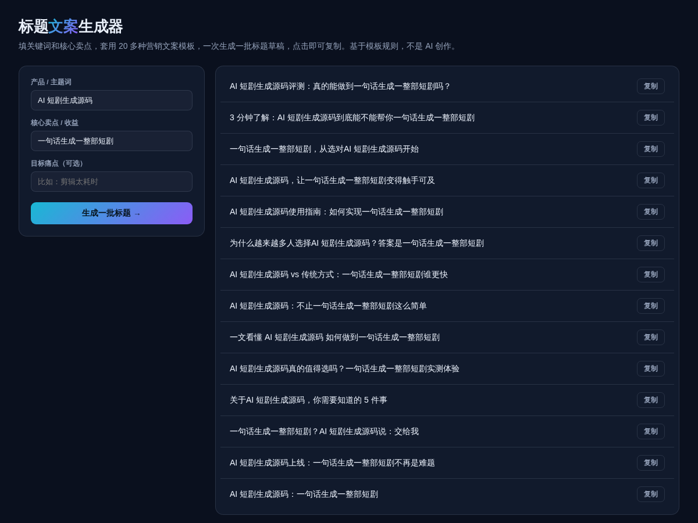

# 标题文案生成器 · Headline Generator

**[在线体验 →](https://anna123123123-creator.github.io/headline-generator/)**

免费开源、纯浏览器运行的标题文案生成器。填关键词和核心卖点，套用 20 多种营销文案模板，一次批量生成一批标题草稿，点击即可复制。基于模板规则填空，不是 AI 创作。



## 试用方法

直接用浏览器打开 `index.html`，或用静态文件服务器跑起来：

```bash
python3 -m http.server 8000
```

填"产品/主题词"和"核心卖点"（必填），"目标痛点"选填——填了会解锁更多带痛点场景的模板。

## 实现原理

内置 20 条营销文案模板（提问式、对比式、痛点式、清单式、评测式……），每条模板里的 `{kw}` `{benefit}` `{pain}` 占位符替换成你填的内容，随机打乱顺序展示。纯字符串模板填空，不涉及任何语言模型。`script.js` 里大概 80 行原生 JavaScript。

## 协议

MIT。

## 需要定制版？

这个工具免费开源、可以直接用。如果你需要的是**改造成适合自己业务的版本**——换品牌、改字段、加功能、接后端或数据库——我可以做。

- **交付周期**：3–10 个工作日
- **交付内容**：完整源码（不加密、可自行二次开发）+ 在线地址 + 部署说明
- **已有 49 套现成系统**可直接改造，覆盖电商、教育、门店、内容、跨境等行业：[全部清单与在线演示](https://inzyxuashop.com)

把你的需求发给我，24 小时内回复可行性与报价：**evcdecd@gmail.com**
